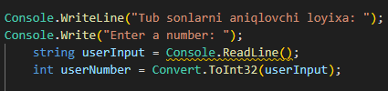
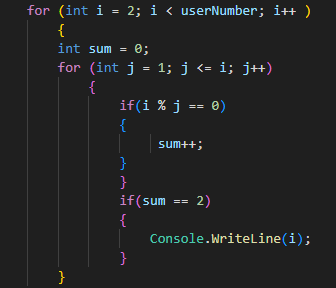

# Tub sonlarni aniqlab beruvchi dastur
----
***ushbu kichik loyixa orqali siz, dasturga kiritgan raqamingizgacha bolgan Tub sonlarni aniqlashingiz mumkin:***

>Birdan katta bolgan natural son ***Tub son*** deyiladi. Tub sonlar oziga va birga bolinadi. Tub son xaqida toliq malumot olish uchun [bu yerga bosing](https://uz.wikipedia.org/wiki/Tub_son) 

# Birinchi qism

# Ikkinchi qism

# Demo

